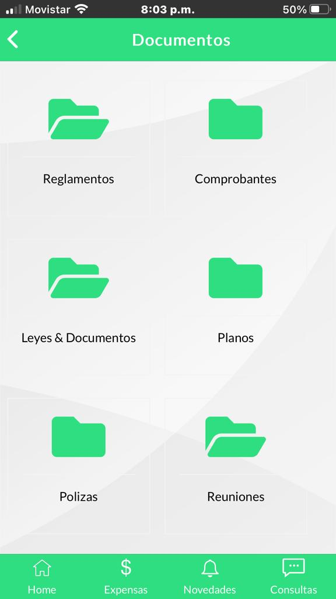

# node-login-system-postgres
Node.js Login and Registration System with PostgreSQL Database | Login, Logout, and User Authentication. This repository provides a secure and scalable login and registration system built with Node.js, utilizing the Express framework and EJS templating engine. 

documento
  ├── config
  │   └── config.js
  ├── controllers
  │   ├── documento.controller.js
  │   └── files.controller.js
  ├── database
  │   └── postgresdb.js
  ├── middlewares
  │   ├── authenticate-JWT.js
  │   └── paginate.js
  ├── node_modules
  ├── routes
  │   └── documento.routes.js
  ├── utils
  │   └── utils.js
  ├── index.js
  ├── package.json
  └── package-lock.json
